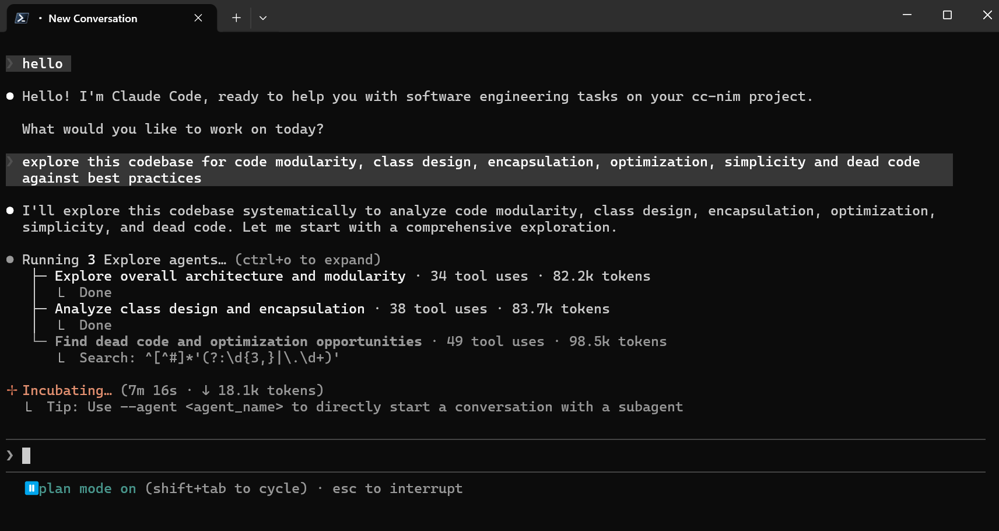

<div align="center">

# 🤖 Free Claude Code

Nutze Claude Code CLI, VS Code, JetBrains ACP oder Chat-Bots über deinen eigenen Anthropic-kompatiblen Proxy.

[](https://opensource.org/licenses/MIT)
[](https://www.python.org/downloads/)
[](https://github.com/astral-sh/uv)
[](https://github.com/Alishahryar1/free-claude-code/actions/workflows/tests.yml)
[](https://pypi.org/project/ty/)
[](https://github.com/astral-sh/ruff)
[](https://github.com/Delgan/loguru)

Free Claude Code leitet Anthropic-Messages-API-Traffic von Claude Code an beliebige Provider weiter. Das clientseitige Protokoll von Claude Code bleibt stabil, während du freie, kostenpflichtige oder lokale Modelle wählen kannst.

[English](README.md) · [Deutsch](README.de.md)

[Schnellstart](#quick-start) · [Provider](#choose-a-provider) · [Clients](#connect-claude-code) · [Integrationen](#optional-integrations) · [Entwicklung](#development)

</div>

<div align="center">
  
</div>

## Dokumentation

| Datei | Englisch | Deutsch |
| --- | --- | --- |
| Hauptdokumentation | [README.md](README.md) | [README.de.md](README.de.md) |
| Agentenrichtlinien | [AGENTS.md](AGENTS.md) | [AGENTS.de.md](AGENTS.de.md) |
| Claude-Hinweis | [CLAUDE.md](CLAUDE.md) | [CLAUDE.de.md](CLAUDE.de.md) |
| Smoke-Tests | [smoke/README.md](smoke/README.md) | [smoke/README.de.md](smoke/README.de.md) |

## Star History

<div align="center">
  <a href="https://star-history.com/#Alishahryar1/free-claude-code&Date">
    <picture>
      <source media="(prefers-color-scheme: dark)" srcset="https://api.star-history.com/svg?repos=Alishahryar1/free-claude-code&type=Date&theme=dark">
      <source media="(prefers-color-scheme: light)" srcset="https://api.star-history.com/svg?repos=Alishahryar1/free-claude-code&type=Date">
      
    </picture>
  </a>
</div>

## Was du bekommst

- Drop-in-Proxy für Anthropic-API-Aufrufe von Claude Code.
- Siebzehn Provider-Backends: NVIDIA NIM, OpenRouter, Google AI Studio (Gemini), DeepSeek, Mistral La Plateforme, Mistral Codestral, OpenCode Zen, OpenCode Go, Wafer, Kimi, Cerebras Inference, Groq, Fireworks AI, Z.ai, LM Studio, llama.cpp und Ollama.
- Pro-Modell-Routing: Leite Opus-, Sonnet-, Haiku- und Fallback-Traffic an unterschiedliche Provider.
- Native Claude-Code-`/model`-Picker-Unterstützung über den Proxy-Endpunkt `/v1/models` (Claude Code muss Gateway-Model-Discovery aktivieren; siehe [Model Picker](#model-picker)).
- Streaming, Tool-Use, Handling von Reasoning/Thinking-Blöcken und lokale Request-Optimierungen.
- Optionaler Discord- oder Telegram-Bot-Wrapper für Remote-Coding-Sessions.
- Optionale Nutzung über die VSCode-Extension.
- Optionale Voice-Note-Transkription per lokalem Whisper oder NVIDIA NIM.
- Lokale **Admin UI** unter `/admin`, um unterstützte Proxy-Einstellungen zu ändern, Änderungen zu validieren und Provider zu prüfen (nur Loopback-Zugriff).

<a id="quick-start"></a>

## Schnellstart

### 1. Schnelle Installation

Installiere Claude Code (falls nicht vorhanden), installiere oder aktualisiere `uv`, dann Python 3.14.0 und Free Claude Code:

macOS/Linux:

```bash
curl -fsSL "https://github.com/Alishahryar1/free-claude-code/blob/main/scripts/install.sh?raw=1" | sh
```

Windows PowerShell:

```powershell
irm "https://github.com/Alishahryar1/free-claude-code/blob/main/scripts/install.ps1?raw=1" | iex
```

Prüfe die Installer in [scripts/install.sh](https://github.com/Alishahryar1/free-claude-code/blob/main/scripts/install.sh) und [scripts/install.ps1](https://github.com/Alishahryar1/free-claude-code/blob/main/scripts/install.ps1).

### 2. Proxy starten

```bash
fcc-server
```

Nach dem Start gibt Uvicorn die Bind-Adresse aus und die App loggt die Admin-URL:

```text
INFO:     Admin UI: http://127.0.0.1:8082/admin (local-only)
```

Viele Terminals machen die URL klickbar. Verwende deinen konfigurierten `PORT`, falls es nicht `8082` ist.

### 3. Admin UI öffnen und NVIDIA NIM konfigurieren

Öffne die **Admin UI**-URL aus der Terminalausgabe.

Brauchst du einen NVIDIA-NIM-API-Key? Siehe den Abschnitt **[NVIDIA-NIM-Provider](#nvidia-nim-provider)** weiter unten und spring dann zurück.

<div align="center">
  
</div>

Füge deinen NVIDIA-NIM-API-Key in `NVIDIA_NIM_API_KEY` ein und klicke auf **Validate** und **Apply**.

Das Standardmodell ist bereits `nvidia_nim/nvidia/nemotron-3-super-120b-a12b`. Du kannst es später in derselben Admin UI ändern.

### 4. Claude Code starten

```bash
fcc-claude
```

`fcc-claude` liest bei jedem Start den aktuell konfigurierten Port und Auth-Token, setzt die Claude-Code-Umgebungsvariablen (inklusive eines `CLAUDE_CODE_AUTO_COMPACT_WINDOW` von 190k Tokens für Auto-Compaction) und startet danach den echten `claude`-Befehl.

<a id="choose-a-provider"></a>

## Provider auswählen

Wähle einen Provider, trage den Key oder die lokale URL in der Admin UI ein und setze `MODEL` auf einen Provider-präfixierten Modell-Slug. `MODEL` ist der Fallback. `MODEL_OPUS`, `MODEL_SONNET` und `MODEL_HAIKU` können das Routing pro Claude-Code-Tier überschreiben.

<a id="nvidia-nim-provider"></a>

### 1. [NVIDIA NIM](https://build.nvidia.com/)

API-Key: [build.nvidia.com/settings/api-keys](https://build.nvidia.com/settings/api-keys).

In der Admin UI unter `NVIDIA_NIM_API_KEY` eintragen. Standard-`MODEL`: `nvidia_nim/nvidia/nemotron-3-super-120b-a12b`.

Beispiele:

- `nvidia_nim/nvidia/nemotron-3-super-120b-a12b`
- `nvidia_nim/z-ai/glm5.1`
- `nvidia_nim/moonshotai/kimi-k2.5`
- `nvidia_nim/minimaxai/minimax-m2.5`

Modelle: [build.nvidia.com](https://build.nvidia.com/explore/discover).

### 2. [OpenRouter](https://openrouter.ai/)

API-Key: [openrouter.ai/keys](https://openrouter.ai/keys).

In der Admin UI `OPENROUTER_API_KEY` setzen, dann `MODEL` z. B. auf `open_router/stepfun/step-3.5-flash:free`.

Modelle: [alle Modelle](https://openrouter.ai/models) oder [freie Modelle](https://openrouter.ai/collections/free-models).

### 3. [Google AI Studio (Gemini)](https://aistudio.google.com/)

Gemini-API-Key über [Google AI Studio](https://aistudio.google.com/apikey) (siehe auch Googles [Gemini OpenAI compatibility](https://ai.google.dev/gemini-api/docs/openai)).

In der Admin UI `GEMINI_API_KEY` setzen und `MODEL` z. B. auf `gemini/gemini-2.5-flash` oder `gemini/gemini-3.1-flash-lite`.

Die Gemini-API bietet einen OpenAI-kompatiblen Endpunkt unter `https://generativelanguage.googleapis.com/v1beta/openai/`. Freikontingente sind modellabhängig; Prompts können außerhalb von UK/CH/EEA/EU ggf. zur Produktverbesserung genutzt werden (abhängig von deiner Region).

Beispiele:

- `gemini/gemini-2.5-flash`
- `gemini/gemini-3.1-flash-lite`

### 4. [DeepSeek](https://platform.deepseek.com/)

API-Key: [platform.deepseek.com/api_keys](https://platform.deepseek.com/api_keys).

In der Admin UI `DEEPSEEK_API_KEY` setzen, dann `MODEL` auf einen DeepSeek-Slug wie `deepseek/deepseek-chat`.

Dieser Provider nutzt DeepSeeks Anthropic-kompatiblen Endpunkt, nicht den OpenAI-Chat-Completions-Endpunkt.

### 5. [Mistral La Plateforme](https://console.mistral.ai/)

[Mistral](https://mistral.ai) bietet eine OpenAI-kompatible Chat-Completions-API unter `https://api.mistral.ai/v1`. Aktiviere den **Experiment**-Plan auf [console.mistral.ai](https://console.mistral.ai/) für Free-Tier-Zugriff mit Limits.

In der Admin UI `MISTRAL_API_KEY` setzen und `MODEL` auf z. B. `mistral/devstral-small-latest` oder `mistral/mistral-small-latest`.

Beispiele:

- `mistral/devstral-small-latest`
- `mistral/mistral-small-latest`

Modelle: [Mistral-Dokumentation](https://docs.mistral.ai/).

### 6. [Mistral Codestral](https://console.mistral.ai/)

Codestral nutzt einen **separaten API-Key** gegenüber La Plateforme: `CODESTRAL_API_KEY` setzen und mit dem Präfix `mistral_codestral/` routen. Standard-Upstream: **`https://codestral.mistral.ai/v1`**.

Beispiel:

- `mistral_codestral/codestral-latest`

### 7. [OpenCode Zen](https://opencode.ai/)

API-Key: [opencode.ai/auth](https://opencode.ai/auth).

In der Admin UI `OPENCODE_API_KEY` setzen und `MODEL` z. B. auf `opencode/gpt-5.3-codex`. Derselbe Key funktioniert auch für **OpenCode Go**.

OpenCode Zen ist ein kuratiertes Gateway mit OpenAI-kompatiblem Endpunkt unter `https://opencode.ai/zen/v1`.

Beispiele:

- `opencode/gpt-5.3-codex`
- `opencode/claude-sonnet-4`
- `opencode/deepseek-v4-flash-free` (free)
- `opencode/gemini-3-flash`
- `opencode/big-pickle` (free)
- `opencode/glm-5.1`

Modelle: [opencode.ai](https://opencode.ai).

### 8. [OpenCode Go](https://opencode.ai/)

API-Key ebenfalls über [opencode.ai/auth](https://opencode.ai/auth).

In der Admin UI `OPENCODE_API_KEY` verwenden und `MODEL` z. B. auf `opencode_go/minimax-m2.7` setzen.

OpenCode Go ist ein Subscription-Gateway mit eigenem Katalog und Endpunkt `https://opencode.ai/zen/go/v1`.

Beispiel:

- `opencode_go/minimax-m2.7`

### 9. [Wafer](https://wafer.ai/)

Key von [wafer.ai](https://wafer.ai). In der Admin UI in `WAFER_API_KEY` eintragen und `MODEL` auf z. B. `wafer/DeepSeek-V4-Pro`.

Beispiele:

- `wafer/DeepSeek-V4-Pro`
- `wafer/MiniMax-M2.7`
- `wafer/Qwen3.5-397B-A17B`
- `wafer/GLM-5.1`

Dieser Provider verwendet den Anthropic-kompatiblen Wafer-Endpunkt `https://pass.wafer.ai/v1/messages`.

### 10. [Kimi](https://platform.moonshot.ai/)

API-Key: [platform.moonshot.ai/console/api-keys](https://platform.moonshot.ai/console/api-keys).

In der Admin UI `KIMI_API_KEY` setzen und `MODEL` z. B. auf `kimi/kimi-k2.5`.

Kimi nutzt eine **Anthropic-kompatible** Messages-API (`https://api.moonshot.ai/anthropic/v1/messages`).

### 11. [Cerebras Inference](https://inference-docs.cerebras.ai/quickstart)

API-Key über [Cerebras Cloud Console](https://cloud.cerebras.ai) (siehe [Quickstart](https://inference-docs.cerebras.ai/quickstart)).

In der Admin UI `CEREBRAS_API_KEY` setzen und z. B. mit `cerebras/llama3.1-8b` oder `cerebras/gpt-oss-120b` routen.

Cerebras bietet eine OpenAI-kompatible API unter `https://api.cerebras.ai/v1`.

### 12. [Groq](https://console.groq.com/)

API-Key: [console.groq.com/keys](https://console.groq.com/keys).

In der Admin UI `GROQ_API_KEY` setzen und `MODEL` z. B. auf `groq/llama-3.3-70b-versatile`.

Groq nutzt `https://api.groq.com/openai/v1`.

### 13. [Fireworks AI](https://fireworks.ai/)

API-Key: [fireworks.ai/account/api-keys](https://fireworks.ai/account/api-keys).

In der Admin UI `FIREWORKS_API_KEY` setzen und `MODEL` z. B. auf `fireworks/accounts/fireworks/models/llama-v3p3-70b-instruct`.

Fireworks nutzt eine **Anthropic-kompatible** Messages-API unter `https://api.fireworks.ai/inference/v1/messages`.

### 14. [Z.ai](https://z.ai/)

API-Key: [Z.ai/manage-apikey/apikey-list](https://z.ai/manage-apikey/apikey-list).

In der Admin UI `ZAI_API_KEY` setzen und `MODEL` z. B. auf `zai/glm-5.1`.

Dieser Provider nutzt die **Anthropic-kompatible** Messages-API von Z.ai (`https://api.z.ai/api/anthropic/v1/messages`).

Beispiele:

- `zai/glm-5.1`
- `zai/glm-5-turbo`

### 15. [LM Studio](https://lmstudio.ai/)

Lokalen LM-Studio-Server starten und ein Modell laden. In der Admin UI `LM_STUDIO_BASE_URL` prüfen/ändern und `MODEL` mit Präfix `lmstudio/` setzen.

Für Claude-Code-Workflows sind Modelle mit Tool-Use-Unterstützung vorzuziehen.

### 16. [llama.cpp](https://github.com/ggml-org/llama.cpp)

`llama-server` mit Anthropic-kompatiblem `/v1/messages`-Endpunkt starten.

In der Admin UI `LLAMACPP_BASE_URL` prüfen/ändern und `MODEL` mit Präfix `llamacpp/` setzen.

Wenn normaler Claude-Code-Traffic HTTP 400 auslöst, `--ctx-size` erhöhen und Server-/Modellfähigkeit prüfen.

### 17. [Ollama](https://ollama.com/)

Ollama starten und Modell ziehen:

```bash
ollama pull llama3.1
ollama serve
```

In der Admin UI `OLLAMA_BASE_URL` prüfen/ändern und `MODEL` auf denselben Tag wie in `ollama list` mit Präfix `ollama/` setzen.

`OLLAMA_BASE_URL` ist die Ollama-Root-URL (kein `/v1` anhängen).

### 18. Provider pro Modell-Tier mischen

Jedes Modell-Tier kann einen anderen Provider nutzen: `MODEL_OPUS`, `MODEL_SONNET` und `MODEL_HAIKU` setzen. Leer gelassene Tiers erben `MODEL`.

Beispiel-Routing: Opus `nvidia_nim/moonshotai/kimi-k2.5`, Sonnet `open_router/deepseek/deepseek-r1-0528:free`, Haiku `lmstudio/unsloth/GLM-4.7-Flash-GGUF`, Fallback `MODEL` auf `zai/glm-5.1`.

<a id="connect-claude-code"></a>

## Claude Code verbinden

### 1. Claude Code CLI

Für Terminal-Nutzung:

```bash
fcc-claude
```

Lass `fcc-server` während der Arbeit laufen. Die Admin UI verwaltet Proxy-Konfiguration, führt bei Runtime-Änderungen Neustarts aus, und `fcc-claude` liest bei jedem Start Port und Auth-Token neu ein. Außerdem wird `CLAUDE_CODE_AUTO_COMPACT_WINDOW` auf `190000` gesetzt.

### 2. VS Code Extension

In Settings nach `claude-code.environmentVariables` suchen, **Edit in settings.json** wählen und eintragen:

```json
"claudeCode.environmentVariables": [
  { "name": "ANTHROPIC_BASE_URL", "value": "http://localhost:8082" },
  { "name": "ANTHROPIC_AUTH_TOKEN", "value": "freecc" },
  { "name": "CLAUDE_CODE_ENABLE_GATEWAY_MODEL_DISCOVERY", "value": "1" },
  { "name": "CLAUDE_CODE_AUTO_COMPACT_WINDOW", "value": "190000" }
]
```

Danach Extension neu laden. Falls Login-Screen erscheint, einmal den Anthropic-Console-Pfad wählen; anschließend läuft Modell-Traffic weiter über den lokalen Proxy.

### 3. JetBrains ACP

Installierte Claude-ACP-Konfiguration bearbeiten:

- Windows: `C:\Users\%USERNAME%\AppData\Roaming\JetBrains\acp-agents\installed.json`
- Linux/macOS: `~/.jetbrains/acp.json`

Env für `acp.registry.claude-acp` setzen:

```json
"env": {
  "ANTHROPIC_BASE_URL": "http://localhost:8082",
  "ANTHROPIC_AUTH_TOKEN": "freecc",
  "CLAUDE_CODE_ENABLE_GATEWAY_MODEL_DISCOVERY": "1",
  "CLAUDE_CODE_AUTO_COMPACT_WINDOW": "190000"
}
```

IDE nach Änderungen neu starten.

<a id="model-picker"></a>

### 4. Model Picker

<div align="center">
  
</div>

<a id="optional-integrations"></a>

## Optionale Integrationen

Für alle Integrationen unten gilt: verwalte **Proxy-Einstellungen** ausschließlich in der **Admin UI** unter `/admin` (Felder ändern, **Validate**, dann **Apply**). Die Footer-Anzeige zeigt den Speicherort der verwalteten Konfiguration.

### 1. Discord- und Telegram-Bots

Der Bot-Wrapper führt Claude-Code-Sessions remote aus, streamt Fortschritt, unterstützt Reply-basierte Gesprächsverzweigungen und kann Tasks stoppen oder zurücksetzen.

**Discord**

1. Bot im [Discord Developer Portal](https://discord.com/developers/applications) erstellen.
2. **Message Content Intent** aktivieren.
3. Bot mit Lese-, Sende- und Message-History-Rechten einladen.
4. Bot-Token und numerische Channel-ID(s) kopieren.

**Telegram**

1. Bot über [@BotFather](https://t.me/BotFather) erstellen und Token kopieren.
2. Numerische User-ID über [@userinfobot](https://t.me/userinfobot) abrufen.

**Konfiguration in der Admin UI**

1. Mit laufendem `fcc-server` die **Admin UI**-URL aus dem Terminal öffnen.
2. In der Sidebar **Messaging** wählen.
3. **Messaging Platform** auf **discord** oder **telegram** setzen.
4. Für Discord **Discord Bot Token** und **Allowed Discord Channels** eintragen. Für Telegram **Telegram Bot Token** und **Allowed Telegram User ID** eintragen.
5. **Allowed Directory** auf einen absoluten Pfad setzen (Workspace-Root, in dem der Bot arbeiten darf).
6. **Validate** und **Apply** klicken. Falls die UI es meldet, Server neu starten.

<div align="center">
  
</div>

<p align="center"><em>Admin UI → Messaging (Plattform, Bots und Voice)</em></p>

**Nützliche Commands**

- `/stop` bricht einen Task ab; als Antwort auf eine Task-Nachricht stoppt es nur diesen Branch.
- `/clear` setzt Sessions zurück; als Antwort wird nur der jeweilige Branch gelöscht.
- `/stats` zeigt den Session-Status.

### 2. Voice Notes

Voice Notes funktionieren auf Discord und Telegram, nachdem du deine [Free-Claude-Code-Installation](#1-schnelle-installation) mit den passenden optionalen Extras erweitert hast.

macOS/Linux:

```bash
# NVIDIA NIM transcription (Riva gRPC)
curl -fsSL "https://github.com/Alishahryar1/free-claude-code/blob/main/scripts/install.sh?raw=1" | sh -s -- --voice-nim

# Local Whisper (CPU or CUDA)
curl -fsSL "https://github.com/Alishahryar1/free-claude-code/blob/main/scripts/install.sh?raw=1" | sh -s -- --voice-local

# Both backends
curl -fsSL "https://github.com/Alishahryar1/free-claude-code/blob/main/scripts/install.sh?raw=1" | sh -s -- --voice-all

# Local Whisper with CUDA
curl -fsSL "https://github.com/Alishahryar1/free-claude-code/blob/main/scripts/install.sh?raw=1" | sh -s -- --voice-local --torch-backend cu130
```

Windows PowerShell:

```powershell
# NVIDIA NIM transcription (Riva gRPC)
& ([scriptblock]::Create((irm "https://github.com/Alishahryar1/free-claude-code/blob/main/scripts/install.ps1?raw=1"))) -VoiceNim

# Local Whisper (CPU or CUDA)
& ([scriptblock]::Create((irm "https://github.com/Alishahryar1/free-claude-code/blob/main/scripts/install.ps1?raw=1"))) -VoiceLocal

# Both backends
& ([scriptblock]::Create((irm "https://github.com/Alishahryar1/free-claude-code/blob/main/scripts/install.ps1?raw=1"))) -VoiceAll

# Local Whisper with CUDA
& ([scriptblock]::Create((irm "https://github.com/Alishahryar1/free-claude-code/blob/main/scripts/install.ps1?raw=1"))) -VoiceLocal -TorchBackend cu130
```

Nach der Neuinstallation `fcc-server` neu starten.

In der **Admin UI** unter **Messaging** zum Bereich **Voice** scrollen: **Voice Notes** aktivieren, **Whisper Device** (`cpu`, `cuda` oder `nvidia_nim`) wählen, **Whisper Model** setzen und ggf. **Hugging Face Token** eintragen. Für **nvidia_nim**-Transkription das `voice`-Extra installieren und **NVIDIA NIM API Key** in **Providers** konfigurieren.

## Wie es funktioniert

<div align="center">
  
</div>

Diagrammquelle: [`assets/how-it-works.mmd`](assets/how-it-works.mmd).

Wichtige Bausteine:

- FastAPI stellt Anthropic-kompatible Routen bereit, z. B. `/v1/messages`, `/v1/messages/count_tokens` und `/v1/models`.
- Modellrouting löst den Claude-Modellnamen zu `MODEL_OPUS`, `MODEL_SONNET`, `MODEL_HAIKU` oder `MODEL` auf.
- NIM, OpenCode Zen und OpenCode Go nutzen OpenAI-Chat-Streaming, das nach Anthropic-SSE übersetzt wird.
- Wafer, OpenRouter, DeepSeek, Kimi, Fireworks AI, Z.ai, LM Studio, llama.cpp und Ollama nutzen (wo passend) Anthropic-Messages-Transporte.
- Der Proxy normalisiert Thinking-Blöcke, Tool-Calls, Token-Usage-Metadaten und Provider-Fehler in die von Claude Code erwartete Form.
- Request-Optimierungen beantworten triviale Claude-Code-Probes lokal, um Latenz und Quotenverbrauch zu reduzieren.

<a id="development"></a>

## Entwicklung

### 1. Projektstruktur

```text
free-claude-code/
├── server.py              # ASGI entry point
├── api/                   # FastAPI routes, service layer, routing, optimizations
├── core/                  # Shared Anthropic protocol helpers and SSE utilities
├── providers/             # Provider transports, registry, rate limiting
├── messaging/             # Discord/Telegram adapters, sessions, voice
├── cli/                   # Package entry points and Claude process management
├── config/                # Settings, provider catalog, logging
└── tests/                 # Unit and contract tests
```

### 2. Aus dem Source ausführen

Für Entwicklung oder direkten Start aus einem Checkout:

```bash
git clone https://github.com/Alishahryar1/free-claude-code.git
cd free-claude-code
uv run uvicorn server:app --host 0.0.0.0 --port 8082
```

### 3. Befehle

```bash
uv run ruff format
uv run ruff check
uv run ty check
uv run pytest
```

Vor dem Push in dieser Reihenfolge ausführen. CI erzwingt dieselben Checks.

### 4. Package-Skripte

`pyproject.toml` installiert:

- `fcc-server`: startet den Proxy mit konfiguriertem Host und Port.
- `fcc-init`: optionales Advanced-Scaffold für `~/.fcc/.env`; für normale Konfiguration die **Admin UI** verwenden.
- `fcc-claude`: startet Claude Code mit konfigurierter lokaler Proxy-URL, Auth-Token, Model-Discovery-Flag und `CLAUDE_CODE_AUTO_COMPACT_WINDOW=190000`.
- `free-claude-code`: Kompatibilitätsalias für `fcc-server`.

### 5. Erweitern

- OpenAI-kompatible Provider durch Erweiterung von `OpenAIChatTransport` hinzufügen.
- Anthropic-Messages-Provider durch Erweiterung von `AnthropicMessagesTransport` hinzufügen.
- Provider-Metadaten in `config.provider_catalog` registrieren und Factory-Wiring in `providers.registry`.
- Messaging-Plattformen durch Implementierung des Interfaces `MessagingPlatform` in `messaging/` ergänzen.

## Beitragen

- [`.env.example`](.env.example) listet Env-Key-Namen als read-only Referenz; verwende die **Admin UI** für Änderungen an verwalteten Proxy-Einstellungen.
- Bugs und Feature-Requests in [Issues](https://github.com/Alishahryar1/free-claude-code/issues) melden.
- Änderungen klein halten und mit fokussierten Tests absichern.
- Keine Docker-Integrations-PRs öffnen.
- Keine README-Änderungs-PRs öffnen; dafür bitte ein Issue erstellen.
- Vor PR-Erstellung die vollständige Check-Sequenz ausführen.
- Die Syntax `except X, Y` ist in Python 3.14 final zurück (nicht in 3.14 alpha). Bitte bei PRs berücksichtigen.

## Lizenz

MIT-Lizenz. Details in [LICENSE](LICENSE).
