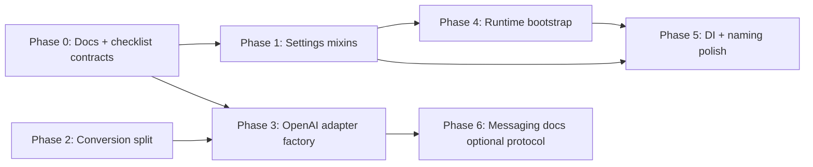

# Implementation plan: architectural improvements

This document implements the architectural review into **shippable work** with explicit phases, file touch lists, acceptance criteria, and PR slicing. It follows existing repo constraints: **import-boundary contract tests**, no `# type: ignore`, full CI (`ruff format`, `ruff check`, `ty`, `pytest`), and [AGENTS.md](../../AGENTS.md) principles.

**Related docs:**

- [layers.md](./layers.md) — package boundaries and provider resolution
- [messaging.md](./messaging.md) — messaging bounded contexts
- [../../providers/notes/adding_a_provider.md](../../providers/notes/adding_a_provider.md) — provider checklist

**Delivery note:** Implementation was consolidated into a single changeset covering Phases 0–5 described below; Phase 3b (native adapter collapse) remains future work unless explicitly scheduled.

---

## Guiding decisions

| Decision | Choice | Rationale |
|----------|--------|-----------|
| Settings refactor style | **Pydantic mixin modules**, not nested `settings.credentials.*` | `admin_persistence` uses `Settings.model_fields[settings_attr]`; flat field names must remain on `Settings` |
| Conversion split | **Submodules + unchanged public exports** | `core/anthropic/__init__.py` and `conversion/__init__.py` stay stable |
| Declarative OpenAI adapters | **Catalog-driven factory for thin adapters only** | Kimi / Fireworks / Z.ai / OpenCode share the same client shape; NIM, OpenRouter, Wafer, DeepSeek, locals stay bespoke |
| Runtime / messaging | **Extract bootstrap module**, not a plugin framework | Minimizes scope; keeps `AppRuntime` as composition root |
| Docs | **`docs/architecture/`** + provider notes | README stays user-facing; internal boundaries documented |

---

## Dependency graph



**Parallelizable:** Phase 0 + Phase 2 (independent). Phase 3 should follow Phase 2 only if request builders move; otherwise Phase 3 can start after Phase 0.

---

## Phase 0 — Foundation (docs + contract guardrails)

**Goal:** Make future refactors safe before large moves.

### 0.1 Provider add checklist (documentation)

**Create:** `providers/notes/adding_a_provider.md`

**Sections (must be decision-complete):**

1. `config/provider_catalog.py` — `ProviderDescriptor` row
2. `providers/registry.py` — `_create_*` factory (or factory registry entry)
3. Adapter module(s) — transport base class choice
4. `api/admin/fields_providers.py` — env keys + `settings_attr`
5. Tests: `tests/providers/test_<id>.py`, registry smoke, golden SSE if applicable
6. `smoke/capabilities.py` — new/updated `CapabilityContract` rows
7. `.env.example` — new env vars
8. Contract tests (below)

**Reference:** `providers/notes/native_anthropic_http_providers.md`

### 0.2 Wiring contract tests

**Create:** `tests/contracts/test_provider_wiring.py`

| Test | Assertion |
|------|-----------|
| `test_every_catalog_entry_has_factory` | Each `PROVIDER_CATALOG` key ∈ `PROVIDER_FACTORIES` |
| `test_credential_env_providers_have_admin_field` | For each `descriptor.credential_env`, some `ConfigFieldSpec.key` equals it |
| `test_admin_settings_attrs_exist_on_settings` | Every `field.settings_attr` ∈ `Settings.model_fields` |
| `test_env_example_covers_credential_envs` | Each `credential_env` appears in `.env.example` (comment or key) |
| `test_openai_chat_ids_subset` | `provider_ids_for_transport("openai_chat")` ⊆ catalog |

**Do not** auto-generate admin fields yet; validation-only first.

### 0.3 Internal architecture doc

**Create:** `docs/architecture/layers.md`

- Layer diagram
- Allowed imports per package
- Provider resolution: `resolve_provider(app=...)` vs `get_provider()` process cache
- Settings reload: `get_settings.cache_clear()` call sites (`api/admin_routes.py`, `cli/entrypoints.py`, `smoke/lib/config.py`)

**Create:** `docs/architecture/messaging.md` (bounded contexts)

### 0.4 README dev note

**Edit:** `README.md` → Development section: `smoke` is dev-only, not in the wheel (`pyproject.toml` `packages` list).

### Acceptance (Phase 0)

- [ ] All new contract tests pass
- [ ] No production code behavior change
- [ ] CI green

### PR

**PR-0:** `docs: architecture boundaries and provider wiring contracts`

---

## Phase 1 — Settings decomposition (mixin modules)

**Goal:** Split `config/settings.py` (~550 lines) into focused modules while **preserving every `Settings` field name and env alias**.

### 1.1 Design: mixin layout

| New module | Fields moved | Existing bundle |
|------------|--------------|-----------------|
| `config/settings_credentials.py` | `open_router_api_key`, `deepseek_api_key`, `kimi_api_key`, `wafer_api_key`, `opencode_api_key`, `zai_api_key`, `fireworks_api_key`, `nvidia_nim_api_key` | — |
| `config/settings_local_providers.py` | `lm_studio_base_url`, `llamacpp_base_url`, `ollama_base_url` | — |
| `config/settings_proxies.py` | All `*_proxy` fields | — |
| `config/settings_model_routing.py` | `model`, `model_opus`, `model_sonnet`, `model_haiku`, thinking flags | Align with `model_routing_settings.py` |
| `config/settings_http.py` | `http_*`, `provider_rate_*`, `fast_prefix_detection` | `ProviderThroughputSettings` / server bundles |
| `config/settings_optimizations.py` | `enable_network_probe_mock`, title/suggestion/filepath skips | `AdminOptimizationSettings` |
| `config/settings_observability.py` | All `log_*`, `debug_*` | `ObservabilitySettings` |
| `config/settings_messaging_flat.py` | `messaging_platform`, rate limit/window, bot tokens, `allowed_*`, `allowed_dir`, log cap | `MessagingSettings` / `BotSettings` |
| `config/settings_voice.py` | `voice_note_enabled`, `whisper_*`, `hf_token` | Part of `BotSettings` today |
| `config/settings_server.py` | `host`, `port`, `anthropic_auth_token` | `ServerRuntimeSettings` |

**Keep in `settings.py`:**

- `ConfiguredChatModelRef`
- Env file helpers (`_env_files`, `_env_file_override`, removed-var guard)
- `Settings` class: **multiple inheritance** from mixins + `BaseSettings`
- Cross-field validators (`validate_model_format`, `check_nvidia_nim_api_key`, `prefer_dotenv_anthropic_auth_token`)
- Methods: `resolve_model`, `configured_chat_model_refs`, `parse_*`, bundles (`@computed_field` / `@property`)
- `get_settings()` + new `reload_settings()`

### 1.2 Implementation pattern

```python
# config/settings_credentials.py
class ProviderCredentialsMixin(BaseModel):
    model_config = ConfigDict(extra="ignore")
    open_router_api_key: str = Field(default="", validation_alias="OPENROUTER_API_KEY")
    # ...

# config/settings.py
class Settings(
    ProviderCredentialsMixin,
    LocalProvidersMixin,
    # ...
    BaseSettings,
):
    nim: NimSettings = Field(default_factory=NimSettings)
    # validators that need multiple groups stay here
```

**Rules:**

- Do **not** change env var names or `validation_alias` values.
- `@computed_field` bundles read from `self` (unchanged external API).
- `registry._credential_for` / `build_provider_config` unchanged (still `getattr(settings, descriptor.credential_attr)`).

### 1.3 Settings reload API

**Add to `config/settings.py`:**

```python
def reload_settings() -> Settings:
    """Clear cache and return a fresh Settings instance."""
    get_settings.cache_clear()
    return get_settings()
```

**Migrate call sites** (replace raw `get_settings.cache_clear()` + optional reload):

| File | Change |
|------|--------|
| `api/admin_routes.py` | `reload_settings()` after apply |
| `cli/entrypoints.py` | `reload_settings()` after init |
| `smoke/lib/config.py` | `reload_settings()` |

Keep `cache_clear` test mocks working (`tests/cli/test_entrypoints.py`).

### 1.4 Tests

**Update:** `tests/config/test_config.py`

- Add tests that each mixin’s fields appear on `Settings.model_fields`
- Keep existing bundle parity tests (`test_*_bundle_reflects_flat_settings`)
- Add `test_reload_settings_returns_fresh_instance` (monkeypatch env between loads)

### 1.5 Optional follow-up (same phase if low cost)

Generate **admin provider secret fields** from catalog in `api/admin/fields_providers.py`:

- For descriptors with `credential_env` + `credential_attr`, build `ConfigFieldSpec` from catalog metadata (`credential_url` → description).
- Keep hand-written fields for base URLs, proxies, NIM-specific copy.
- Contract test: generated keys match catalog.

### Acceptance (Phase 1)

- [ ] `Settings()` and `get_settings()` behavior unchanged for all existing tests
- [ ] `tests/config/test_config.py` green
- [ ] Admin validate/apply still resolves `_field_input_key` via `model_fields`
- [ ] `config` import boundary test still passes
- [ ] No file in `config/` imports `api` / `providers` / `core`

### PRs

- **PR-1a:** Mixin extraction (credentials, local, proxies, HTTP)
- **PR-1b:** Mixin extraction (routing, messaging, voice, observability, optimizations) + `reload_settings()`
- **PR-1c (optional):** Catalog-driven admin credential fields

---

## Phase 2 — Split `core/anthropic/conversion`

**Goal:** Break `_conversion.py` (~513 lines) into maintainable units without changing public API.

### 2.1 Target module layout

| File | Contents |
|------|----------|
| `conversion/types.py` | *(existing)* `OpenAIConversionError`, `ReasoningReplayMode` |
| `conversion/validation.py` | `_openai_reject_native_only_top_level_fields`, `_assert_no_forbidden_assistant_block` |
| `conversion/tool_helpers.py` | Tool serialization and ordering helpers |
| `conversion/reasoning.py` | `_clean_reasoning_content`, `_think_tag_content` |
| `conversion/pending.py` | `_PendingAfterTools` dataclass |
| `conversion/converter.py` | `AnthropicToOpenAIConverter` class only |
| `conversion/request_body.py` | `build_base_request_body` |
| `conversion/__init__.py` | Re-export same `__all__` as today |
| `_conversion.py` | **Delete** after move |

### 2.2 Import rules

- Submodules may import `core.anthropic.content`, `core.anthropic.utils`, `.types`
- No imports from `api`, `providers`, `config`
- `core/anthropic/__init__.py` unchanged exports

### 2.3 Tests (must not change behavior)

| Test file | Purpose |
|-----------|---------|
| `tests/core/test_conversion_golden.py` | Golden request bodies |
| `tests/providers/test_converter.py` | Broad conversion cases |
| `tests/providers/test_nvidia_nim_request.py` | Provider integration |

**Process:** Run golden tests before/after; byte-identical outputs.

### Acceptance (Phase 2)

- [ ] `from core.anthropic.conversion import AnthropicToOpenAIConverter, build_base_request_body` still works
- [ ] `tests/contracts` `test_core_does_not_import_product_packages` passes
- [ ] No new file > ~250 lines unless justified
- [ ] CI green

### PR

**PR-2:** `refactor: split anthropic conversion into submodules`

---

## Phase 3 — Declarative OpenAI-chat adapters

**Goal:** Remove duplicate `client.py` wrappers where behavior is identical.

### 3.1 Eligibility matrix

| Provider | Action | Reason |
|----------|--------|--------|
| `kimi` | **Factory** | Thin `OpenAIChatTransport` + `request.build_request_body` |
| `fireworks` | **Factory** | Same |
| `zai` | **Factory** | Same |
| `opencode` | **Factory** | Same; `provider_name` param for `opencode_go` |
| `opencode_go` | **Factory** | Second catalog entry, same class, different `default_base_url` / name |
| `nvidia_nim` | **Keep bespoke** | `nim_settings` injection |
| `open_router` | **Keep bespoke** | SSE event mode, model list, block policy |
| `deepseek` | **Keep bespoke** | `request.py` sanitization |
| `wafer` | **Keep bespoke** | Default thinking injection in body |
| `lmstudio`, `llamacpp`, `ollama` | **Defer** | Native transport; separate Phase 3b (optional) |

### 3.2 Catalog extension

**Edit:** `config/provider_catalog.py` — add optional fields to `ProviderDescriptor`:

```python
openai_provider_label: str | None = None      # e.g. "KIMI" -> _provider_name
openai_request_module: str | None = None      # e.g. "providers.kimi.request"
```

Only set for eligible `openai_chat` entries.

### 3.3 Factory implementation

**Create:** `providers/openai_chat_adapter.py`

**Edit:** `providers/registry.py` — replace thin `_create_*` with `_create_openai_chat_from_catalog(provider_id)`.

**Keep package exports** (`from providers.kimi import KimiProvider`) via alias in `providers/kimi/__init__.py`.

### 3.4 Tests

- Existing provider tests must pass unchanged imports
- Add `tests/providers/test_openai_chat_adapter.py`
- Extend `tests/contracts/test_provider_wiring.py`

### Acceptance (Phase 3)

- [ ] No cross-import between `providers/*/request.py` modules
- [ ] `test_provider_factories_mirror_catalog_ids` passes
- [ ] Provider-specific request tests unchanged
- [ ] Import boundary: providers still must not import `api`/`messaging`/`cli`

### PR

**PR-3:** `refactor: catalog-driven OpenAI chat provider factory`

---

## Phase 4 — Runtime bootstrap extraction

**Goal:** Slim `api/runtime.py` (~314 lines) by moving wiring details out.

### 4.1 New module

**Create:** `messaging/bootstrap.py`

- `MessagingRuntimeOptions` dataclass
- `build_messaging_platform_options()`
- `create_messaging_stack()` — factory + CLI + handler + tree restore

**Keep in `api/runtime.py`:** startup/shutdown orchestration, provider registry, `app.state` publishing.

### 4.2 NIM transcription boundary

Only `messaging/bootstrap.py` imports `providers.nvidia_nim.transcription_backend`. Update `_API_ALLOWED_PROVIDER_MODULES` in contract tests if `api/runtime.py` no longer imports it.

### 4.3 Tests

- `tests/api/test_runtime_registry_lifecycle.py`
- `tests/messaging/test_messaging_factory.py`
- New `tests/messaging/test_bootstrap.py`

### Acceptance (Phase 4)

- [ ] Optional messaging off (`messaging_platform=none`) unchanged
- [ ] Tree restore on startup still works
- [ ] Shutdown order: messaging → CLI → registry → limiter (unchanged)

### PR

**PR-4:** `refactor: extract messaging bootstrap from AppRuntime`

---

## Phase 5 — DI clarity and small API polish

### 5.1 Rename process-cache helpers

| Old | New |
|-----|-----|
| `get_provider()` | `get_process_cached_provider()` |
| `get_provider_for_type()` | `get_process_cached_provider_for_type()` |

Keep **deprecated aliases** for one release. Update tests and contract needles.

### 5.2 Exception handlers use request-scoped settings

**Edit:** `api/app.py` — `Depends(get_settings)` in handlers instead of inner `get_settings()`.

### 5.3 Admin persistence split (optional)

If touching persistence in Phase 1:

- `api/admin_env_read.py`
- `api/admin_env_write.py`
- `admin_persistence.py` re-exports

### Acceptance (Phase 5)

- [ ] Contract: `api.routes` / `api.services` still have **no** `get_provider(`
- [ ] CI green

### PR

**PR-5:** `refactor: clarify process provider cache naming and settings DI`

---

## Phase 6 — Messaging structure (docs + optional protocol)

### 6.1 Documentation

Expand `docs/architecture/messaging.md` with inbound/outbound sequence.

### 6.2 Optional: `PlatformOutbound` protocol

**Create:** `messaging/platforms/outbound.py` — use in `messaging/commands.py` incrementally.

### PR

**PR-6:** `docs: messaging architecture` (+ optional protocol)

---

## Phase 3b (optional, later) — Native adapter strategies

Implement convergence described in `providers/notes/native_anthropic_http_providers.md`. High risk — separate milestone.

---

## Observability port (deferred backlog)

- `core/observability.py` with `trace_event()` backend
- Track as issue; not in initial PR set

---

## Full verification matrix (every PR)

```bash
uv run ruff format
uv run ruff check
uv run ty check
uv run pytest
```

| Phase | Extra tests |
|-------|-------------|
| 0 | `uv run pytest tests/contracts/test_provider_wiring.py -v` |
| 1 | `uv run pytest tests/config/ tests/api/test_admin.py -v` |
| 2 | `uv run pytest tests/core/test_conversion_golden.py tests/providers/test_converter.py -v` |
| 3 | `uv run pytest tests/providers/ -v` |
| 4 | `uv run pytest tests/api/test_runtime_registry_lifecycle.py tests/messaging/ -v` |
| 5 | `uv run pytest tests/api/test_dependencies.py tests/contracts/ -v` |

**Smoke (manual, pre-release):** `FCC_SMOKE_TARGETS=api,provider uv run pytest -m live smoke/prereq/ -q`

---

## PR sequence summary

| PR | Title | Est. risk | Depends on |
|----|-------|-----------|------------|
| PR-0 | Docs + wiring contracts | Low | — |
| PR-1a/b/c | Settings mixins (+ optional admin gen) | Medium | PR-0 |
| PR-2 | Conversion split | Medium | — |
| PR-3 | OpenAI catalog factory | Medium | PR-0, PR-2 recommended |
| PR-4 | Messaging bootstrap | Medium | PR-1 |
| PR-5 | DI + naming | Low | PR-1 |
| PR-6 | Messaging docs/protocol | Low | PR-4 |

**Suggested merge order:** `0 → 1a → 1b → 2 → 3 → 4 → 5 → (6)`

---

## Definition of done (program complete)

- [ ] `config/settings.py` under ~200 lines (validators + composition only)
- [ ] `core/anthropic/conversion/_conversion.py` removed
- [ ] At least 4 OpenAI-chat providers use catalog factory
- [ ] `api/runtime.py` under ~220 lines; bootstrap in `messaging/bootstrap.py`
- [ ] `reload_settings()` used at all reload sites
- [ ] `docs/architecture/` describes layers, provider resolution, messaging
- [ ] `tests/contracts/test_provider_wiring.py` guards catalog/admin/settings alignment
- [ ] All five CI jobs green on `main`
- [ ] No new import-boundary violations

---

## Risks and mitigations

| Risk | Mitigation |
|------|------------|
| Admin breaks after Settings split | Contract test `settings_attr` ∈ `model_fields`; run `tests/api/test_admin.py` every PR-1 commit |
| Golden conversion drift | Run `test_conversion_golden` before merge; no logic changes in Phase 2 |
| Factory hides provider bugs | Keep per-provider `request.py` tests; only delete duplicate `client.py` after alias proves stable |
| `get_settings` stale after admin apply | Centralize `reload_settings()`; test reload in `tests/config` |
| OpenCode two IDs share one key | Catalog factory passes distinct `default_base_url` and `provider_name` per descriptor |

---

## Intentionally deferred

- Full nested `settings.providers.kimi_api_key` paths (breaks admin)
- Collapsing native Anthropic adapters (Phase 3b)
- OpenTelemetry / observability port
- Packaging `smoke` in the wheel
- Auto-generating all admin fields from Settings schema (only credential subset in PR-1c)

---

## First implementation step

Start **PR-0** (contracts + docs): zero runtime risk, immediately guards Phases 1 and 3.
