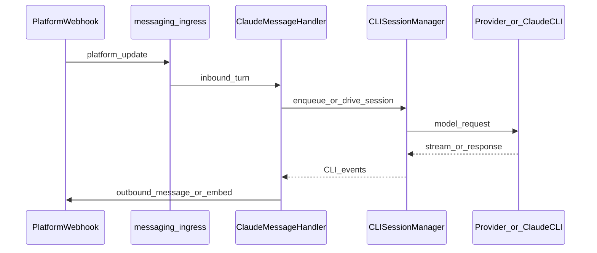
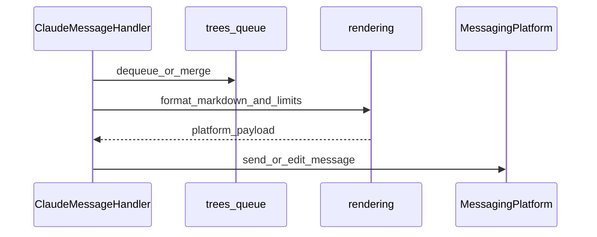

# Messaging bounded contexts

Optional bot integration (`messaging`) is layered so it stays independent of HTTP routes and upstream providers.

## Contexts

| Context | Responsibility | Typical modules |
|---------|----------------|-----------------|
| Ingress | Translate platform updates into inbound user turns | `platforms/*/handlers.py`, `incoming_turn.py`, `platforms/factory.py` |
| Orchestration | Queue ordering, Claude CLI drives, handler coordination | `handler.py`, `trees/*`, `claude_node_processor.py`, `command_dispatcher.py` |
| Presentation | Markdown, truncation, status UX | `rendering/*`, `handler_queue_ux.py`, `transcript*.py`, `ui_updates.py` |
| Session persistence | Stored trees and mappings | `session.py`, tree sync from handler |

Composition root: **`api.runtime.AppRuntime`** starts messaging in two steps:

1. **`messaging/bootstrap.py`** — maps [`Settings`](../../config/settings.py) to [`MessagingPlatformOptions`](../../messaging/platforms/factory.py) (tokens, transcription backend, limits) and creates the platform; restores conversation trees from persisted session data when wiring the handler.
2. **`api/messaging_startup.py`** — builds [`CLISessionManager`](../../cli/manager.py), [`SessionStore`](../../messaging/session.py), and [`ClaudeMessageHandler`](../../messaging/handler.py), then attaches the handler and starts the platform (`messaging` must not import `cli`).

Messaging must never import `providers.*` dynamically; see `tests/contracts/test_messaging_dynamic_providers.py`.

## Inbound sequence (high level)

## Outbound sequence (high level)

## Public surface

Stable symbols for tests and external wiring are re-exported from [`messaging/__init__.py`](../../messaging/__init__.py). Prefer importing from that package rather than deep leaves when adding new integration code, so tests can patch the façade module when needed.

## Outbound typing

[`PlatformOutbound`](../../messaging/platforms/outbound.py) narrows the queued send/edit surface consumed by [`messaging/handler.py`](../../messaging/handler.py) and command helpers. Implementations remain concrete [`MessagingPlatform`](../../messaging/platforms/base.py) subclasses.
