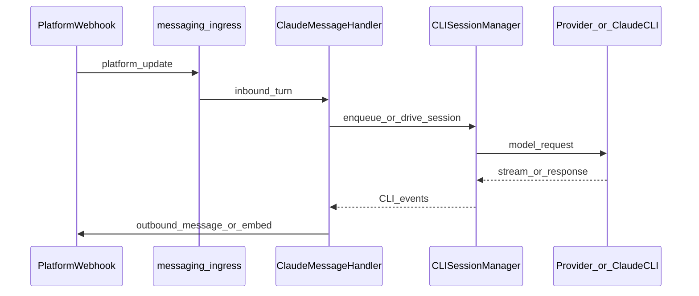
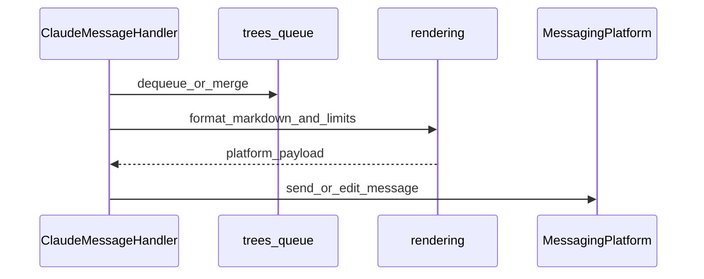

# Messaging bounded contexts

Optional bot integration (`messaging`) is layered so it stays independent of HTTP routes and upstream providers.

**Layers / import contracts:** [`layers.md`](layers.md); dynamic `providers.*` loading is forbidden — [`tests/contracts/test_messaging_dynamic_providers.py`](../../tests/contracts/test_messaging_dynamic_providers.py); allowlisted `importlib` under `providers/` — [`tests/contracts/test_providers_dynamic_imports.py`](../../tests/contracts/test_providers_dynamic_imports.py).

## Where to put new code

| Location | Responsibility |
|---------|----------------|
| [`messaging/trees/`](../../messaging/trees/) | Tree queue semantics, node state, merge rules (LOC-heavy: `data.py`, `manager.py`). Prefer additive changes alongside existing helpers. |
| [`messaging/handler.py`](../../messaging/handler.py), [`messaging/claude_node_processor.py`](../../messaging/claude_node_processor.py) | Claude session orchestration, handler ↔ queue seams. Keeps CLI/workflow coupling out of platforms. |
| [`messaging/platforms/`](../../messaging/platforms/) | Concrete adapters (Telegram, Discord). Maintain [`MessagingPlatform`](../../messaging/platforms/base.py) + outbound queue narrowing [`PlatformOutbound`](../../messaging/platforms/outbound.py). |
| [`messaging/rendering/`](../../messaging/rendering/) | Markdown / limits / platform formatting. |
| `transcript*.py`, [`messaging/session.py`](../../messaging/session.py), [`messaging/ui_updates.py`](../../messaging/ui_updates.py) | Transcript buffering, persisted session/store, outbound UI/command updates. |
| [`messaging/incoming_turn.py`](../../messaging/incoming_turn.py), [`command_dispatcher.py`](../../messaging/command_dispatcher.py) | Inbound dispatcher and command UX. |
| Related HTTP orchestration façade (optional navigation) | [`api/pipeline/__init__.py`](../../api/pipeline/__init__.py) | Thin re-exports of [`api/message_create_pipeline.py`](../../api/message_create_pipeline.py); edit the implementation module, not façade-only shims. |

## Composition roots vs HTTP

Do **not** import `cli` from `messaging` ([`messaging_startup.py`](../../api/messaging_startup.py) bridges `cli.manager`):

| Stage | Module | Role |
|-------|--------|------|
| Settings → platform selection | [`messaging/bootstrap.py`](../../messaging/bootstrap.py) | `create_optional_messaging_platform`, tokens, transcription backend hooks. |
| Session/handler/stack | [`api/messaging_startup.py`](../../api/messaging_startup.py) | Builds `CLISessionManager`, `SessionStore`, `ClaudeMessageHandler`; calls `platform.start()`. |

**HTTP entry:** Orchestration stays in **`api.runtime.AppRuntime`** ([`api/runtime.py`](../../api/runtime.py)); see also [`docs/architecture/api-package.md`](api-package.md) for parity with gateway layout.

## Contexts

| Context | Responsibility | Typical modules |
|---------|----------------|-----------------|
| Ingress | Translate platform updates into inbound user turns | `platforms/*/handlers.py`, `incoming_turn.py`, `platforms/factory.py` |
| Orchestration | Queue ordering, Claude CLI drives, handler coordination | `handler.py`, `trees/*`, `claude_node_processor.py`, `command_dispatcher.py` |
| Presentation | Markdown, truncation, status UX | `rendering/*`, `handler_queue_ux.py`, `transcript*.py`, `ui_updates.py` |
| Session persistence | Stored trees and mappings | `session.py`, tree sync from handler |

Composition root: **`api.runtime.AppRuntime`** starts messaging in two steps:

1. **`messaging/bootstrap.py`** — maps [`Settings`](../../config/settings.py) to [`MessagingPlatformOptions`](../../messaging/platforms/factory.py) (tokens, transcription backend, limits) and creates the platform; restores conversation trees from persisted session data when wiring the handler.
2. **`api/messaging_startup.py`** — builds [`CLISessionManager`](../../cli/manager.py), [`SessionStore`](../../messaging/session.py), and [`ClaudeMessageHandler`](../../messaging/handler.py), then attaches the handler and starts the platform (`messaging` must not import `cli`).

Messaging must never import `providers.*` dynamically; see `tests/contracts/test_messaging_dynamic_providers.py`.

## Inbound sequence (high level)

## Outbound sequence (high level)

## Public surface

Stable symbols for tests and external wiring are re-exported from [`messaging/__init__.py`](../../messaging/__init__.py). Prefer importing from that package rather than deep leaves when adding new integration code, so tests can patch the façade module when needed.

## Outbound typing

[`PlatformOutbound`](../../messaging/platforms/outbound.py) narrows the queued send/edit surface consumed by [`messaging/handler.py`](../../messaging/handler.py) and command helpers. Implementations remain concrete [`MessagingPlatform`](../../messaging/platforms/base.py) subclasses.
